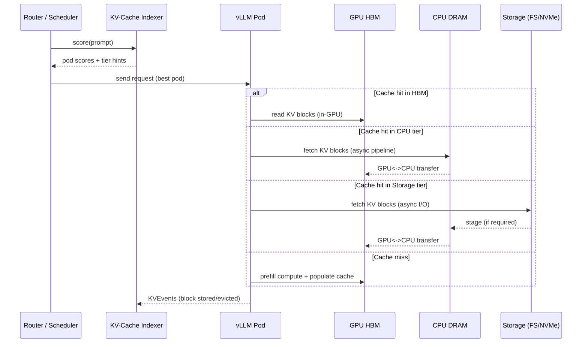

# llm-d Cache Manager and Tiered KV Cache Offloading to CPU Memory and Persistent Storage

## Executive summary

llm-d’s “cache management” for inference is best understood as a **two-layer system**: (a) a **control/metadata plane** that tracks where cached blocks live across replicas and makes cache-aware routing decisions, and (b) a **data plane** that actually moves **KV-cache blocks** between tiers (GPU HBM ↔ CPU DRAM ↔ storage) using entity["organization","vLLM","llm inference engine"] connectors and backends. The flagship control-plane component is the **KV-Cache Indexer** (in the `llm-d-kv-cache` project), which builds a near-real-time view of KV-block locality by ingesting KV-cache events emitted by vLLM, then scores candidate pods for an incoming prompt. citeturn21search0turn15view0turn6view1

As of early 2026, llm-d’s most concrete, documented offloading capabilities are centered on **prefix KV cache** (and closely related “prefix computation state” caches). The llm-d “tiered-prefix-cache” guide explicitly uses “prefix cache” to mean KV tensors **and other prefix-state caches**, calling out State Space Model caches (e.g., Mamba SSM states) as a second example; it does **not** document activation checkpointing or generic embedding caches as managed/offloaded tiers. citeturn14search6turn16view1

For persistent storage offload, llm-d introduced a **filesystem (FS) backend** that plugs into vLLM’s offloading mechanism and stores KV blocks as files on a shared filesystem (directory-as-index), enabling both **cross-replica reuse** and **persistence across restarts** (subject to storage durability). The llm-d FS backend is positioned as complementary to CPU offloading and cache-aware routing—storage is larger and cheaper per GB but usually slower than DRAM and may involve an extra hop through CPU memory. citeturn22view2turn22view3turn9view0

Benchmark evidence in llm-d documentation is strongest today for (1) vLLM’s CPU KV offloading (via its “offloading connector” design) and (2) LMCache-backed shared storage connectors used within llm-d’s “well-lit path” guides. Where specific figures for the llm-d FS backend are unavailable in official guides, they should be treated as **unspecified** (even if a blog post describes qualitative or single-workload outcomes). citeturn14search1turn22view2turn5view0

## Scope and terminology

### What “model cache” means in llm-d’s current design

In llm-d’s official guides, the cache tiering discussion is primarily about **prefix caching for inference**, i.e., caching intermediate computation for already-processed prefix tokens so future requests with the same prefix can skip some or all of prefill. For transformer attention, this cached state is the **KV cache**; for certain state-space models, the guide also highlights caching **SSM state** for prefix positions. citeturn14search6turn16view1

### Supported cache types (documented vs unspecified)

The table below reflects what is explicitly supported or described in llm-d and vLLM documentation sources reviewed for this report.

| Cache type | Status in llm-d cache/offload docs | Notes |
|---|---|---|
| KV cache (attention keys/values) | **Supported / primary focus** citeturn22view2turn21search0turn14search6 | Central to the KV-Cache Indexer and all tiered offloading guides. |
| “Prefix computation states” beyond KV | **Partially documented** citeturn14search6turn16view1 | llm-d guide explicitly includes non-KV prefix caches conceptually. |
| Mamba / SSM state cache | **Documented in concept and in vLLM flags** citeturn14search6turn16view1 | vLLM exposes Mamba cache tuning flags (dtype, block size, cache mode). |
| Activations (general) | **Unspecified** | No llm-d documentation reviewed describes activation offloading as a cache tier. |
| Embedding caches (generic) | **Unspecified** | llm-d docs reviewed focus on prefix-state caching rather than embedding stores. |

## Architecture and design

### Cache manager architecture in llm-d

llm-d’s cache manager architecture centers on *knowing* where caches are (and at what tier) so that incoming requests can be routed to the replica most likely to have the needed prefix blocks locally, minimizing redundant prefill. The `llm-d-kv-cache` project describes itself as a **pluggable service** enabling KV-cache-aware routing, with its **KV-Cache Indexer** building a global, near-real-time view of KV-block locality across a fleet of vLLM pods using `KVEvents`. citeturn21search0turn14search4turn15view0

The KV-Cache Indexer ingests **event streams** emitted when blocks are created/evicted. Its event processing pipeline (Write Path) uses a ZMQ subscriber receiving msgpack messages, shards processing by pod-id to preserve ordering per pod, parses vLLM-specific topics (`kv@pod-id@model`), and applies events to an index backend (Add/Evict). citeturn15view0turn6view1

A critical design choice is **hash compatibility with vLLM**. The indexer computes block keys via chained hashing of token chunks. It explicitly documents: (1) prompts tokenized and chunked into fixed-size blocks (default 16), (2) block key computed as FNV-64a over a CBOR-encoded tuple `[parentHash, tokenChunk, extra]`, and (3) initialization from a `HashSeed` that must align with `PYTHONHASHSEED` used by vLLM pods to ensure consistent hashes across the system. citeturn15view0turn6view1

The `extra` field is a first-class mechanism for **cache differentiation** (preventing cache pollution). It can encode LoRA adapter IDs, adapter names, or structured metadata; different `extra` values produce different block hashes, preventing reuse when the same token sequence is used under different adapters or multimodal inputs. citeturn15view0

### Read-path scoring and cache-aware routing

On the read/scoring path, llm-d’s cache-aware router (often described as running in an “external processing” component in llm-d deployments) tokenizes incoming prompts, computes the same block hashes, queries the index for which pods have which blocks, and scores pods based on consecutive prefix matches, with optional weighting by tier (GPU vs CPU). The architecture documentation and configuration schema describe tier-aware scoring via `kvCacheBackendConfigs` (e.g., GPU weight 1.0 and CPU weight 0.8 in example configuration). citeturn6view1turn6view2turn21search1

image_group{"layout":"carousel","aspect_ratio":"16:9","query":["llm-d KV cache aware routing architecture diagram","llm-d KV-Cache Indexer architecture","vLLM KV cache offloading connector diagram","GPUDirect Storage diagram"],"num_per_query":1}

### Architecture and data-flow diagrams (mermaid)

The following diagrams summarize the “control plane” (routing/indexing) and “data plane” (offloading tiers) described in llm-d and vLLM sources. citeturn15view0turn22view2turn5view0turn14search6

```mermaid
flowchart LR
  Client[Client / App] --> GW[llm-d Gateway / Routing Layer]
  GW -->|Prompt| Tok[Tokenizer + Block Hashing]
  Tok -->|Keys| IDX[KV-Cache Indexer]
  IDX -->|Pod scores (tier-aware)| GW
  GW -->|Route request| PodA[vLLM Pod A]
  GW -->|Route request| PodB[vLLM Pod B]

  subgraph vLLM_PodA[vLLM Pod A cache tiers]
    AHBM[GPU HBM KV blocks]
    ACPU[CPU DRAM KV blocks]
    AFS[Shared FS / Local NVMe KV blocks]
    AHBM <--> ACPU
    ACPU <--> AFS
  end

  subgraph Events[KVEvents stream]
    PodA -->|ZMQ pub (msgpack)| SUB[Indexer Subscriber]
    PodB -->|ZMQ pub (msgpack)| SUB
    SUB --> IDX
  end
```



## Offloading mechanisms to CPU RAM and to persistent storage

### CPU RAM offloading mechanisms

At the vLLM layer, CPU KV cache offloading is exposed as a configurable buffer that enables vLLM to offload KV cache to CPU memory via a selected backend (`native` or `lmcache`). vLLM’s engine arguments document `--kv-offloading-size` (GiB) to enable KV offloading to CPU and `--kv-offloading-backend` to choose the backend. citeturn17view1turn16view1

vLLM’s KV offloading connector design (introduced as a connector interface) emphasizes **asynchronous and pipelined data movement** so that offload operations can overlap compute and avoid adding latency on the cache-miss critical path. In its design description, vLLM notes that KV offloading latency is “not user-facing” in that it “does not affect TTFT for cache misses,” and it highlights the need for parallelism and pipelining to cover the slowest leg of the data path (often storage I/O if present). citeturn5view0

From llm-d’s perspective, CPU offloading is recommended as a low-operational-overhead tier to expand HBM capacity. The llm-d tiered-prefix-cache guide specifically recommends enabling CPU RAM offloading due to greater capacity than HBM and typically faster transfer than recomputation, and it positions future tier-aware routing as work in progress. citeturn14search6

### Persistent storage (SSD/NVMe and shared filesystem) mechanisms

#### The llm-d FS backend

The llm-d FS backend is described as a storage backend that **plugs into vLLM’s offloading mechanism**, stores KV blocks as **files** on a filesystem, and uses the directory as the index of stored blocks—making it persistent and shareable across nodes connected to the filesystem. citeturn22view1turn22view2

Key documented design choices include:

- **Filesystem agnostic POSIX operations**, enabling use with many filesystems (including shared/remote). citeturn22view2  
- **Asynchronous I/O** via vLLM’s offloading connector so KV reads/writes can proceed without blocking the “main path.” citeturn22view2turn5view0  
- **Parallel I/O** across worker threads to increase throughput and decrease tail latency, plus default **GPU DMA-based transfers** to minimize GPU compute interference. citeturn22view2turn9view0

The FS backend documentation (repo guide) further details implementation techniques such as thread-local pinned staging buffers, multi-threaded I/O per GPU, and explicit support for **atomic block writes/reads** in the file-based backend (as documented in the backend’s guide and GDS notes). citeturn9view0turn10view0

#### GPUDirect Storage considerations

The FS backend includes optional support for **NVIDIA GPUDirect Storage** (GDS) where supported, described as bypassing CPU staging buffers and using `cuFile`/`libcufile`. The GDS guide details prerequisites (supported filesystem modes and kernel configuration), runtime behavior (dynamic loading of cuFile), and multiple modes (including “bounce buffer” for certain storage setups). citeturn10view0

#### LMCache connector in llm-d guides

llm-d’s storage offloading guide also documents using an external KV cache layer (LMCache) as a vLLM connector for shared storage. It provides benchmark tables for “vLLM + CPU offloading + Lustre (via the LMCache connector)” and notes the community expectation that eviction/cleanup is handled by storage systems or external tooling rather than by the connector itself. citeturn14search1

### Paging, serialization, and compression

- **Paging / block-based management:** Both vLLM and llm-d’s indexer are explicitly **block-oriented**. The indexer reflects vLLM’s block hashing and a fixed token block size (default 16). citeturn15view0turn6view1  
- **Serialization:** llm-d FS backend’s public description is “stores KV blocks as files” and treats the directory as an index. The exact on-disk encoding and any record format beyond “file per KV block” are **not fully specified** in the reviewed public docs; the documentation emphasizes POSIX operations and offloading connector integration rather than a serialized schema. citeturn22view1turn9view0  
- **Compression:** llm-d FS backend documentation reviewed does **not** describe built-in KV compression. For compression-aware tiering, academic systems such as EVICPRESS propose joint eviction + lossy compression to improve hit rates on fast tiers while preserving quality; EVICPRESS reports up to ~2.19× TTFT improvement at equivalent quality in its evaluation. citeturn14search7  
- **LMCache control-plane features:** The LMCache paper describes explicit control APIs (including “compression” alongside pinning/cleanup/movement) for orchestrating KV across GPU/CPU/storage/network tiers, which may be relevant when compression is required. citeturn14academia34turn14search17

## Consistency, correctness, latency, and memory management policies

### Correctness and cache identity

llm-d’s precise cache-awareness depends on **hash correctness** and **tokenizer consistency**:

- The indexer documents that it “perfectly matches vLLM’s content-addressing logic,” using token chunking and chained hashing with a system-wide hash seed that must align with `PYTHONHASHSEED` in vLLM pods. A mismatch can systematically produce false misses (or, worse, collisions if mis-implemented). citeturn15view0turn6view1  
- “Cache differentiation” via the `extra` field is a key mitigation against incorrect reuse across LoRA adapters or multimodal paths. This enables a practical production pattern: namespace cache identities by adapter/tenant/workload variant by including distinguishing metadata in `extra` so identical token sequences do not incorrectly share KV state. citeturn15view0  

For storage persistence across time, **model identity/versioning** becomes part of correctness. The vLLM KVEvents topic includes the model name in the topic format (as parsed by the adapter), and the indexer is explicitly model-aware at ingestion. However, if an operator reuses the same model name while changing weights/revision, **stale persisted blocks** can become semantically invalid; llm-d docs reviewed do not specify a built-in “model revision” mechanism for invalidating stored KV across such upgrades. This should be treated as an operational responsibility (e.g., versioned model identifiers or storage namespaces). citeturn15view0turn22view1

### Consistency of the distributed cache index (KVEvents reliability)

A cache index built from event streams is only as accurate as its event delivery:

- llm-d’s indexer pipeline ensures **per-pod event ordering** by sharding tasks based on pod identity (hashed) so events from the same pod are processed in order. citeturn15view0  
- However, vLLM’s KV event transport uses **ZMQ PUB/SUB**, and vendor guidance warns PUB/SUB is **lossy** (messages may be dropped). NVIDIA’s Dynamo documentation explicitly calls out lossiness and the need for mechanisms to handle missed messages and recovery. citeturn3search11  
- vLLM provides a KV events subscriber example that includes both a PUB/SUB socket and a “replay” socket, which suggests one approach to recovery from missed publications. Whether llm-d’s precise routing deployments fully automate replay/reconciliation is **not fully specified** in the llm-d-kv-cache architecture doc reviewed; operators should treat the index as **near-real-time, best-effort** unless a stronger protocol is explicitly configured. citeturn3search3turn15view0  

Practical correctness implication: **false positives** in the index (thinking a pod has blocks it no longer has) can increase latency if the system routes to a pod that then incurs a miss and recomputation. This is generally “safe” (it devolves to a miss) but can harm tail latency. llm-d mitigations in practice include combining cache scoring with load/utilization scorers (documented in llm-d scheduler discussions) so routing is not purely cache-affinity. citeturn21search4turn21search13

### Latency implications by tier

llm-d’s own FS backend blog summarizes the fundamental latency tradeoff:

- For single-request workloads, GPU/CPU caching is typically faster than shared storage, because storage is generally slower than DRAM and storage→GPU may add an extra CPU hop; however, for long prompts, reusing KV (even from storage) can be substantially faster than recomputing prefill, reporting up to ~16.8× speedup vs prefill on long prompts in one benchmark setup. citeturn22view2  
- The key advantage of shared storage is sustaining throughput and latency stability when the KV working set grows beyond GPU/CPU cache capacity (e.g., many concurrent users with distinct long prefixes), especially when the storage layer enables cross-replica reuse. citeturn22view3  

### Memory management policies and tiering behavior

llm-d’s public documentation exposes policies most clearly in **two places**: (1) index backends and (2) external offload connectors.

**Indexer memory policies (metadata plane).** The `kvblock.Index` supports multiple backends:

- In-memory backend is explicitly a **two-level LRU** (block key → LRU of pods having it), favoring speed over persistence. citeturn15view0turn6view2  
- “Cost-aware memory” backend uses Ristretto and is described as performing eviction based on actual memory usage (“cost-aware eviction”)—a form of size-based policy. citeturn15view0turn6view2  
- Distributed backends include Redis and Valkey for replicated/shared indexer deployments (with different operational and licensing tradeoffs). citeturn15view0turn6view2  

**Tier-aware routing weights (control plane).** The indexer configuration includes `kvCacheBackendConfigs` with numeric weights per tier (example: `gpu` weight 1.0, `cpu` weight 0.8). This is a policy lever that nudges routing toward faster tiers when possible, while still benefiting from CPU hits. citeturn6view2

**KV block placement/eviction (data plane).** For actual KV data placement, the documentation varies by backend:

- vLLM exposes multiple KV offload backends (`native`, `lmcache`) and documents KV offloading buffer sizing; internal eviction behavior specifics are not fully described in the cited vLLM CLI docs, but vLLM does document scheduler safeguards intended to prevent “KV cache thrashing” under chunked prefill. citeturn17view1turn21search3  
- The vLLM codebase (as reflected in its API documentation navigation) includes KV offload policy modules named `lru` and `arc`, implying the presence of LRU- and ARC-style policies for some KV offload components; detailed semantics would require confirming against code-level documentation for the exact vLLM version deployed. citeturn20view0  
- llm-d’s FS storage connector explicitly **does not handle cleanup/eviction** of stored KV files; capacity management is delegated to the storage system or an external controller, and llm-d points to a PVC-based “evictor” reference implementation in the KV-cache repository. citeturn14search1turn8view0  

## Performance evidence and benchmark methodology

### Benchmarks for shared storage offloading in llm-d documentation

#### llm-d FS backend blog benchmarks (illustrative evidence)

The FS backend blog describes a single-request TTFT experiment across tiers (GPU, CPU, shared storage) on a system running a Llama-3.1-70B class model with **4× H100 GPUs** and **IBM Storage Scale**, measuring speedup vs prefill. It reports that KV loading vs recomputation becomes increasingly beneficial with larger token counts, achieving up to ~16.8× speedup on long prompts—while reiterating that storage is usually slower than DRAM and best used to extend capacity and stability at scale. citeturn22view2turn22view3

The same blog describes scalability experiments: as user count (working set) grows beyond GPU and CPU tier capacity, storage-backed caching helps sustain throughput and avoid performance collapse, particularly when shared storage enables reuse across replicas. citeturn22view3

#### llm-d “well-lit path” benchmark table for LMCache + Lustre (quantitative evidence)

The llm-d storage offloading guide provides a quantitative table comparing **baseline vLLM + CPU offloading** versus **vLLM + CPU offloading + Lustre (via LMCache connector)** for very long system prompts (50K and 70K). citeturn14search1

The following charts are derived directly from those published table values. citeturn14search1


**Interpretation (computed from the published table values):**

- At **50K** system prompt length, mean TTFT improves from **25.38s** to **20.12s** (~20.7% lower), and overall throughput rises from **18,962 tok/s** to **23,262 tok/s** (~22.7% higher). citeturn14search1  
- At **70K**, mean TTFT improves from **58.02s** to **45.00s** (~22.4% lower), and overall throughput rises from **16,825 tok/s** to **21,656 tok/s** (~28.7% higher). citeturn14search1  

A compact reproduction of the published table values is included below for reference.

| System prompt length | Configuration | Mean TTFT (s) | P90 TTFT (s) | Mean E2E (s) | Overall throughput (tok/s) |
|---:|---|---:|---:|---:|---:|
| 50K | Baseline (vLLM + CPU offloading) | 25.38 | 37.74 | 56.21 | 18,962 citeturn14search1 |
| 50K | + Lustre (LMCache connector) | 20.12 | 34.02 | 45.83 | 23,262 citeturn14search1 |
| 70K | Baseline (vLLM + CPU offloading) | 58.02 | 74.75 | 87.99 | 16,825 citeturn14search1 |
| 70K | + Lustre (LMCache connector) | 45.00 | 64.79 | 68.28 | 21,656 citeturn14search1 |

**Important “unspecified” note:** the same llm-d guide states “llm-d FS connector benchmarks [are] coming soon,” so guide-level, apples-to-apples performance tables specifically for the llm-d FS connector are not yet available in that guide. citeturn14search1

### vLLM CPU KV offloading connector microbenchmarks (how the underlying data plane is evaluated)

vLLM’s offloading connector blog (released Jan 2026) provides detailed methodology and several microbenchmarks:

- It introduces a connector interface to offload KV blocks and states that it enables **CPU offloading** as well as pluggable offload backends, emphasizing asynchronous and pipelined movement. citeturn5view0  
- It reports TTFT reductions of roughly **2×–22×** and throughput improvements up to **~9×** under its microbenchmark workloads, framing the gains as avoiding recomputation under preemption and improving effective capacity. citeturn5view0  
- It describes transfer-bandwidth considerations and includes measured throughput figures for GPU↔CPU movement under certain conditions (e.g., high bidirectional bandwidth reported in one configuration). citeturn5view0  
- It documents a vLLM server configuration pattern using `--kv-transfer-config` to enable the offloading connector. citeturn5view0  

## Production deployment, integration, security, and economics

### Integration points with common LLM software stacks

llm-d is explicitly positioned as Kubernetes-native distributed inference spanning multiple vLLM instances, and its KV cache management is therefore most directly integrated with:

- **vLLM-based serving stacks**, including use of vLLM KVEvents and connector APIs. citeturn21search0turn15view0turn22view2  
- **Hugging Face model/tokenizer ecosystems**, via tokenizer acquisition and caching mechanisms. The KV cache indexer supports tokenizers from local disk and/or Hugging Face downloads with caching and fallback strategies; examples document use of an HF token via environment variables. citeturn15view0turn21search9  
- **SGLang** as an additional engine type in configuration (engine adapters and event handling), though llm-d’s most mature cache-aware routing documentation remains vLLM-centric. citeturn6view2turn14search21  

Regarding frameworks named in the request:

- **PyTorch** is implicitly required by vLLM; vLLM’s engine args discuss “eager-mode PyTorch” and toggling eager execution, grounding vLLM in the PyTorch runtime. citeturn16view1  
- **TensorFlow** integration is **not documented** in llm-d cache offloading sources reviewed; production use should assume llm-d’s cache manager is tightly coupled to vLLM-style engines rather than TF-native serving. (Unspecified in sources.)  
- **DeepSpeed** is not cited as a direct integration point for llm-d’s KV cache manager; DeepSpeed is more commonly associated with training and weight/offload techniques. (Unspecified in llm-d cache manager sources.)  
- **FlashAttention** appears in vLLM benchmark methodology as an attention backend used in evaluations, but it is not itself the cache offloading layer. citeturn5view0  

### APIs, CLI surfaces, and configuration knobs

#### vLLM knobs commonly used within llm-d deployments

The most direct knobs for CPU KV offloading are vLLM CLI arguments:

- `--kv-offloading-size` (GiB) to enable CPU offloading buffer  
- `--kv-offloading-backend` ∈ {`native`, `lmcache`} citeturn17view1  

vLLM also exposes the structured `--kv-transfer-config` argument (“distributed KV cache transfer configurations”), which is used in connector-based designs including offloading connectors. citeturn17view2turn5view0  

Example (illustrative) vLLM CLI snippet:

```bash
vllm serve <model> \
  --kv-offloading-size 128 \
  --kv-offloading-backend native
```

#### llm-d KV-Cache Indexer configuration

The `llm-d-kv-cache` configuration is documented as JSON-serializable and split across:

- `indexerConfig` (including index backend settings)  
- `kvEventsConfig` (socket endpoints, engine type, discovery options)  
- `tokenProcessorConfig` (block size, hash seed, tokenizer sources) citeturn21search1turn6view2  

Example (schematic) configuration shape:

```json
{
  "indexerConfig": { "...": "..." },
  "kvEventsConfig": { "...": "..." },
  "tokenProcessorConfig": { "...": "..." }
}
```

Index backend choices include in-memory, cost-aware memory, Redis, and Valkey; these are exposed in both high-level design docs and configuration docs. citeturn15view0turn6view2turn21search1

#### Storage connector operational constraints (important for production)

The llm-d storage guide explicitly notes that the storage connector **does not** handle eviction/cleanup of cached KV files on shared storage, and that storage capacity management must be handled by the underlying storage system or an external controller (including a referenced PVC-based evictor example). citeturn14search1turn8view0

This design choice is operationally significant: without an eviction controller (or storage lifecycle policies), a shared storage KV cache can fill disks and fail workloads.

### Persistence, recovery, and durability guarantees

llm-d’s persistent storage story is “durable to the extent your storage is durable”:

- The FS backend uses a directory as an index and is described as persistent and shareable across all nodes attached to the filesystem, and it states that KV can survive restarts/rescheduling “depending on storage durability.” citeturn22view2  
- The llm-d tiered-prefix-cache guide similarly highlights persistence across restarts/failures as a benefit of shared storage, and frames durability/access control as inherited from enterprise storage systems (e.g., shared filesystems). citeturn14search6turn22view2  
- The default KV cache index backend is in-memory LRU—fast but ephemeral. Persistence of the *index* is possible via Redis/Valkey backends, but using a distributed index backend is described as potentially “overkill” given short KV lifetimes; durability of the index is therefore generally not provided by default. citeturn15view0turn6view2  

### Security and privacy analysis

The sources reviewed emphasize “enterprise storage integration” and “existing access control” at the storage layer, but do not document built-in encryption features for the KV cache payload itself. citeturn22view2turn14search6

**Implications:**

- **Data sensitivity:** KV cache contents are derived from user prompts and can encode sensitive prompt information. Persisting KV blocks on shared storage increases the security boundary and retention window. (General inference from KV cache semantics; llm-d docs emphasize persistence/sharing. citeturn22view2turn14search6)  
- **Encryption at rest:** **Unspecified** in llm-d FS backend docs reviewed. Recommended mitigation is storage-level encryption (filesystem/volume encryption, encrypted object storage) and per-tenant namespaces/keys where applicable. (Operator guidance; not specified as built-in.)  
- **Access control:** llm-d explicitly relies on storage systems’ “monitoring and access control” capabilities for enterprise integration; this implies operators should enforce least privilege at the filesystem/PVC level and restrict which pods can mount the KV cache volume. citeturn14search6turn22view2  
- **Multi-tenant isolation:** To prevent cross-tenant cache sharing, use cache differentiation via the documented `extra` field (or equivalent namespacing) so identical prompts across tenants do not map to identical cache keys. citeturn15view0  

### Hardware tradeoffs and recommended profiles

The llm-d docs and vendor notes converge on a simple tiering rule: keep the “hottest” KV close to compute, and only push to slower tiers when capacity pressures demand it.

**Recommended baseline profile (most deployments): GPU HBM + CPU DRAM tiers**

- llm-d recommends always setting up HBM and CPU RAM tiers and adding additional tiers when cache needs exceed those capacities. citeturn14search6  
- vLLM explicitly supports KV offloading buffers to CPU and exposes backends. citeturn17view1turn16view1  
- Vendor guidance notes that CPU offloading benefits from fast CPU↔GPU interconnect; entity["company","Red Hat","enterprise software company"] recommends modern platforms (e.g., PCIe Gen5+) for CPU offloading scenarios. citeturn2search0  

**Scale-out with persistent storage: shared filesystem + optional GDS**

- The FS backend is designed for “any filesystem,” using POSIX operations and a shared storage path, and was tested with multiple filesystem types (including local NVMe-mounted filesystems and CephFS) according to the blog. citeturn22view2  
- If using GDS, the FS backend’s guide emphasizes meeting GDS prerequisites and selecting GDS modes appropriate to storage (local NVMe vs shared). citeturn10view0  

**Distributed KV cache index backends (Redis/Valkey)**
- Valkey is listed as an optional distributed backend, but example documentation notes RDMA support for Valkey is not yet available in Go client libraries, and an `enableRDMA` flag is a placeholder that falls back to TCP. This is a concrete limitation for low-latency index deployments. citeturn21search2  

### Cost implications

llm-d’s cost argument is primarily a **$/GB** and **capacity elasticity** argument:

- The FS backend blog explicitly argues that storage offers “far superior $ per GB ratio” compared to memory and scales “nearly infinitely” relative to HBM/DRAM, making it suitable for large working sets, cross-replica reuse, and persistence across restarts/scale-down events. citeturn22view0turn22view2  
- CPU DRAM is positioned as a middle tier: larger than HBM with lower operational overhead than shared storage, often fast enough that transfer beats recomputation. citeturn14search6turn22view2  

The practical economic model is: **maximize hit rate on the lowest-latency tier that fits the active working set**, and use cheaper tiers to expand the effective cache capacity while keeping routing smart enough to avoid pathological tail latency.

### Open-source repos, licensing, and community activity

Key open-source artifacts (per sources reviewed):

- `llm-d-kv-cache` is the cache-indexing / cache-aware routing component repository; it describes itself as enabling KV-Cache-aware routing and cross-node cache coordination for vLLM-based serving. citeturn21search0  
- The `llm-d-kv-cache` package metadata shows an entity["organization","Apache License 2.0","software license"] license and recent releases (e.g., version v0.7.1 dated Apr 2026 in the package view). citeturn1view4  
- PR activity in early 2026 includes functional fixes such as addressing a data race in the tokenization pool (`Pool.SetTokenizer`), indicating active maintenance and typical concurrency-hardening work in this component. citeturn14search5  

License status for the FS backend repository and for llm-d core was not explicitly captured in the limited excerpts reviewed here; treat as **unspecified** unless confirmed directly from repository `LICENSE` files in your environment.

### Known limitations, failure modes, and mitigations

| Risk / failure mode | Why it occurs | Mitigations (practical) | Source basis |
|---|---|---|---|
| Stale or missing KVEvents → incorrect routing | ZMQ PUB/SUB can drop messages; index may be temporarily stale | Use replay/reconciliation if available; combine cache score with load score; treat cache index as “hint” | ZMQ lossiness noted citeturn3search11turn3search3turn15view0 |
| Hash/tokenizer mismatch → systematic cache misses | Hash seed and tokenization must match vLLM exactly | Align `HashSeed`/`PYTHONHASHSEED`; manage tokenizer versions; prefer local tokenizers for reproducibility | citeturn15view0turn6view1 |
| Storage tier fills up (no eviction) | FS connector does not evict; KV files accumulate | Storage lifecycle policies; external PVC evictor/controller; monitoring and alerting | citeturn14search1turn8view0 |
| Cross-tenant cache leakage | Shared storage/cross-replica reuse can share identical prefixes | Namespace caches via `extra` (tenant/workspace id) or separate storage paths per tenant | citeturn15view0turn22view2 |
| RDMA not realized for Valkey index | Go client RDMA support missing | Accept TCP; isolate index on low-latency network; revisit when client support lands | citeturn21search2 |
| Combining CPU + storage offload not “turnkey” | Guide notes CPU+storage combined configuration not fully covered | Follow tracked guidance; test in staging; prefer one connector at a time initially | citeturn14search1 |

### Migration and deployment guidance (production-oriented)

A pragmatic production migration path (aligned with documented “well-lit paths” and the separation of concerns between control plane and data plane) is:

1. **Start with vLLM prefix caching + CPU KV offload (single-node or small cluster)**  
   Enable `--kv-offloading-size` and choose a backend; confirm that cache hits reduce TTFT/compute in your workload and that CPU↔GPU bandwidth is adequate. citeturn17view1turn14search6turn5view0  

2. **Introduce llm-d cache-aware routing (control plane) before adding storage**  
   Deploy the KV-Cache Indexer, ingest KVEvents, and validate correctness of hashing/tokenization (especially hash seed alignment). Treat cache scoring as a routing hint and keep load-based safety valves to avoid hot-spotting. citeturn21search0turn15view0turn21search4  

3. **Add persistent storage only when the working set exceeds HBM+DRAM or when cross-replica reuse is required**  
   Choose between LMCache-based connectors (with documented guide benchmarks) and the llm-d FS backend (native file-based). Ensure you also deploy eviction/capacity policy, because the FS connector does not manage cleanup. citeturn14search1turn22view2turn8view0  

4. **Harden operations: observability, capacity planning, and safety**  
   Monitor: cache hit rates per tier, storage IO bandwidth, tail latencies, and index health. Validate failure recovery behavior under restarts and event loss. Keep clear versioning/namespace boundaries so persisted KV is never reused across incompatible model revisions. citeturn22view3turn3search11turn15view0
